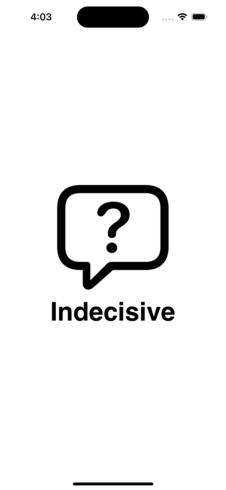

# Indecisive

An iOS application for when making a decision feels like an impossible task. This simple app offers three classic decision-making tools: flipping a coin, rolling a dice, and spinning a wheel. 

## Table of Contents 
- [About The Project](#about-the-project)
- [Built With](#built-with)
- [Installation](#installation)
- [Usage](#usage)
- [License](#license)
- [Contact](#contact)
- [Acknowledgments](#acknowledgments)

## About The Project 
For this project, I took on the challenge of coding with a new framework, resulting in the creation of "Indecisive"—an iOS app designed for those moments of indecision, whether it's choosing where to eat or picking an outfit. Having relied on online randomizers in the past, I recognized the need for a consolidated decision-making tool, sparking the idea for "Indecisive." In the span of 8 days, I deepened my understanding of iOS development by personally crafting visual assets and exploring app structures. Despite its simplicity, the development of "Indecisive" brought forth unique challenges that enriched my knowledge and skills in app development

[⬆️ Back to Top](#indecisive)

## Built With
- [SwiftUI](<https://developer.apple.com/xcode/swiftui/>)
- [Xcode](<https://developer.apple.com/xcode/>)

[⬆️ Back to Top](#indecisive)

## Installation 
1. Make sure you have `Xcode version 14.0 or above` installed on your computer.
2. Download the `Indecisive project files` from the repository.
3. Open the project files in Xcode.
4. Run the project files in XCode's iOS simulator.

Once the simulator is running, you should be able to open the Indecisive app and be able to use it functionalities. 

[⬆️ Back to Top](#indecisive)

## Usage
Indecisive has three classic decision-making tools: 
1. [Flip a Coin](#flip-a-coin)
2. [Roll a Dice](#roll-a-dice)
3. [Spin a Wheel](#spin-a-wheel)

App Startup | Splash Screen | Home Screen
--- | --- | --- 
 |  | 

### Flip a Coin

"Clicking the 'Flip' button presents you with two possibilities: `heads or tails`.

[⬆️ Back to Tools](#usage)

"Flip a Coin" Walkthrough | Default Screen | Result Screen
--- | --- | --- 
 |  | 

### Roll a Dice

"Clicking the 'Roll' button presents you with six possibilities: `1, 2, 3, 4, 5 or 6`.

[⬆️ Back to Tools](#usage)

"Roll a Dice" Walkthrough | Default Screen | Result Screen
--- | --- | --- 
 |  | 

### Spin a Wheel

"Clicking the 'Spin' button presents you with eight possibilities: `1, 2, 3, 4, 5, 6, 7 or 8`.

[⬆️ Back to Tools](#usage)

"Spin a Wheel" Walkthrough | Default Screen | Result Screen
--- | --- | --- 
 |  | 

[⬆️ Back to Top](#indecisive)

## License 
Distributed under the MIT License. See `LICENSE.txt` for more information.

[⬆️ Back to Top](#indecisive)

## Contact 

Kyle Ngo - <kylengo2002@gmail.com> - [LinkedIn](<www.linkedin.com/in/kyle-ngo-2628b5210>)

Project Link:

<https://github.com/KNgo2002/Indecisive/>

[⬆️ Back to Top](#indecisive)

## Acknowledgments
Here are some key resources I found helpful during the development process:
* [CodeWithChris](<https://youtu.be/K0t-RCSlasE?si=PdELqqQqFslZTvC7>)
* [Indently](<https://youtu.be/0ytO3wCRKZU?si=4oJh59BsthZRd_gp>)
* [LearnEDU](<https://youtu.be/-XcNs22WnTc?si=2MkkYsvjcnCnN5Pa>)

[⬆️ Back to Top](#indecisive)
